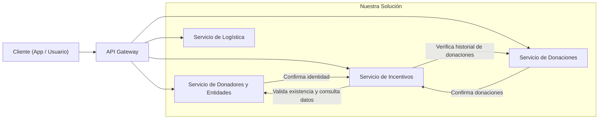

```mermaid
flowchart LR
    subgraph Sistema["Nuestra Solución"]
        direction TB
        Donadores["Servicio de Donadores y Entidades"]
        Donaciones["Servicio de Donaciones"]
        Logistica["Servicio de Logística"]
        Incentivos["Servicio de Incentivos"]
    end

    Cliente["Cliente (App / Usuario)"] --> APIGateway["API Gateway"]
    APIGateway --> Donadores
    APIGateway --> Donaciones
    APIGateway --> Logistica
    APIGateway --> Incentivos

    
    Incentivos --"Valida existencia y consulta datos"--> Donadores
    Donadores --"Confirma identidad" -->Incentivos
    
    Incentivos --"Verifica historial de donaciones"--> Donaciones
    Donaciones --"Confirma donaciones"--> Incentivos
```