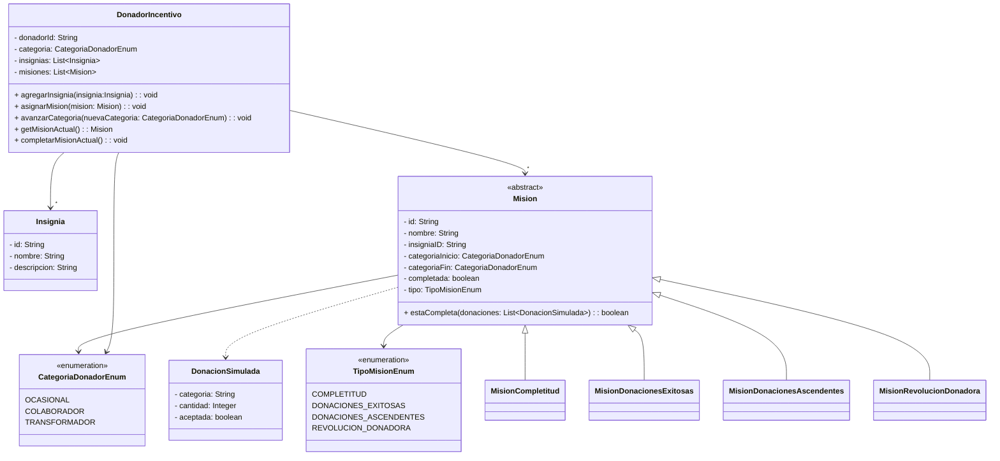

```mermaid
classDiagram
direction TB

    class Insignia {
        - id: String
        - nombre: String
        - descripcion: String
    }

    class DonacionSimulada {
        - categoria: String
        - cantidad: Integer
        - aceptada: boolean
    }

    class DonadorIncentivo {
        - donadorId: String
        - categoria: CategoriaDonadorEnum
        - insignias: List~Insignia~
        - misiones: List~Mision~

        + agregarInsignia(insignia:Insignia): void
        + asignarMision(mision: Mision): void
        + avanzarCategoria(nuevaCategoria: CategoriaDonadorEnum): void
        + getMisionActual(): Mision
        + completarMisionActual(): void
    }

    class Mision {
        <<abstract>>

        - id: String
        - nombre: String
        - insigniaID: String
        - categoriaInicio: CategoriaDonadorEnum
        - categoriaFin: CategoriaDonadorEnum
        - completada: boolean
        - tipo: TipoMisionEnum

        + estaCompleta(donaciones: List~DonacionSimulada~): boolean
    }

    class MisionCompletitud

    class MisionDonacionesExitosas

    class MisionDonacionesAscendentes

    class MisionRevolucionDonadora

    class CategoriaDonadorEnum {
        <<enumeration>>
        OCASIONAL
        COLABORADOR
        TRANSFORMADOR
    }

    class TipoMisionEnum {
        <<enumeration>>
        COMPLETITUD
        DONACIONES_EXITOSAS
        DONACIONES_ASCENDENTES
        REVOLUCION_DONADORA
    }

    DonadorIncentivo --> "*" Insignia
    DonadorIncentivo --> "*" Mision
    Mision --> CategoriaDonadorEnum
    DonadorIncentivo --> CategoriaDonadorEnum
    Mision ..> DonacionSimulada
    Mision --> TipoMisionEnum

    Mision <|-- MisionCompletitud
    Mision <|-- MisionDonacionesExitosas
    Mision <|-- MisionDonacionesAscendentes
    Mision <|-- MisionRevolucionDonadora
```